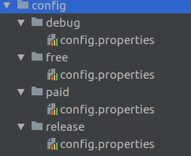

# Android Environments build gradle plugin
[](https://jitpack.io/#IlyaPavlovskii/Android-Environments)
[](https://opensource.org/licenses/Apache-2.0)
[](https://travis-ci.com/IlyaPavlovskii/Android-Environments.svg?branch=master)

[](https://codecov.io/github/IlyaPavlovskii/Android-Environments?branch=master)
[](https://sonarcloud.io/dashboard?id=IlyaPavlovskii_Android-Environments)

[]( https://android-arsenal.com/details/1/7733 )

[](https://patreon.com/ipavlovskii)

Android Environments plugin helps us to avoid manual declaration of build 
config fields in each of the build types or product flavors. It's no longer required
to write `buildConfigField` for every single field.

## Table of Contents
- [How to install](#how-to-install)
- [How to use](#how-to-use)
- [Contributing](#contributing)
- [License](#license)

### How to install
Add next fields in your root `build.gradle` file:
Using plugin DSL:
```groovy
plugins {
  id "android.environments" version "1.0.3"
}
```
Using legacy plugin application:
```groovy
buildscript {
  repositories {
    maven {
      url "https://plugins.gradle.org/m2/"
    }
  }
  dependencies {
    classpath "by.bulba.android.environments:android.environments:1.0.3"
  }
}

apply plugin: "android.environments"
```

Then setup your application `build.gradle` file:
```groovy
apply plugin: 'by.bulba.android.environments'

android {
    environments {
        useBuildTypes = true
        useProductFlavors = true
    }
}
```

### How to use

Just add `environments` extension in your project `build.gradle` file 
and set it up. This extension provides you a way to define your configuration file
location and build config field rules.
 
[build.gradle]
```groovy
environments { 
    // Environments root directory.
    // Default value - "config" 
    configPath = "config"  
    // Configuration file name.
    // Default value - "config.properties"
    configFile = "config.properties"
    // Set to true when you need to use custom environments on each 
    // build types(debug or release).
    // Default value - false
    useBuildTypes = true 
    // Set to true when you need to use custom environments on each
    // product flavor.
    // Default value - false
    useProductFlavors = true
    // Configuration file format
    // Select on of available type for your config file [json,yml,properties - default value]
    format = "properties"
}
``` 

Then you'll be able to locate all of your configuration files by build types and 
product flavors folders.



Plugin supports next file extensions:`.json`,`.yml` or `.properties`(by default)
```properties
key.build.type.value="debug value"
key-int=123
key-LOng=78L
KEY_float=32.1f
key.some.boolean=true
```
Plugin is intellegent enough to automatically convert your environment fields to the known types
(String, Integer, Long, Float or Boolean).

```java
public final class BuildConfig {
  //...
  // Fields from the variant
  public static final String KEY_FLAVOR_VALUE = "free_value";
  // Fields from build type: debug
  public static final String KEY_BUILD_TYPE_VALUE = "debug value";
  public static final Float KEY_FLOAT = 32.1f;
  public static final Integer KEY_INT = 123;
  public static final Long KEY_LONG = 78L;
  public static final Boolean KEY_SOME_BOOLEAN = true;
  public static final String TEST_VALUE = "MY_TEST_VALUE";
}
```

### Contributing
  
When contributing to this repository, please first discuss the change you wish to make via issue, email, or any other method with the owners of this repository before making a change.
Please note we have a code of conduct, please follow it in all your interactions with the project.
When you found some problems, bugs or you want to propose some new features, please see the next rules of the project.

1. Make sure that your issue is not duplicated [here](https://github.com/IlyaPavlovskii/Android-Environments/issues).  
2. Assign to discuss.
3. Create a new issue.

Before changes:
1. Take an issue, move to status "In progress" and assign persons to this task. 
2. Create a new branch by the next rules:
```
$issue-label/ae-$(issue-number)/$iteration-number
example:
enhancement/ae-10/0
```
3. Commit your changes by the next rules:
```
ae-$(issue-number): $short-task-description
example:
ae-3: Add JSON config reader property
```
4. Pull your changes to remote.
5. Make sure your changes didn't break something after you, CI build is a success.
6. When syntax analyzer find some problems with code quality or test quality, please fix it
or write the causes of deterioration in github issue.
7. Create pull-request and, optionally, assign some contributors to it.

### License

    Copyright (C) 2019 Ilya Pavlovskii

    Licensed under the Apache License, Version 2.0 (the "License");
    you may not use this file except in compliance with the License.
    You may obtain a copy of the License at

       http://www.apache.org/licenses/LICENSE-2.0

    Unless required by applicable law or agreed to in writing, software
    distributed under the License is distributed on an "AS IS" BASIS,
    WITHOUT WARRANTIES OR CONDITIONS OF ANY KIND, either express or implied.
    See the License for the specific language governing permissions and
    limitations under the License.

